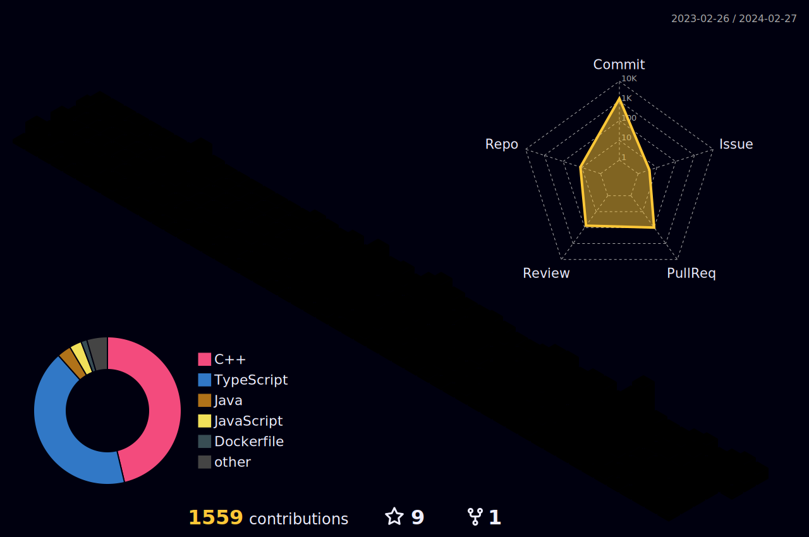

# 👋 Hey, This is Haward (Joushin)

Welcome to my GitHub profile! Feel free to explore my repositories, check out my contributions, and reach out if you have any questions or collaborations in mind.
## 📫 Contact & Information

-  
- 
- 
- 

### GitHub contribution graph

### baekjoon

###  42Seoul
  

## 📝 My Study Blog

- [Haward's Code Circus](https://haward.tistory.com/): My journey through coding, technology, and beyond.
 

## 🎓 Education
- Seoul National University of Science and Technology (Seoultech), Computer Engineering, 2023 - Present.
- Transitioned from Department of Mechanical System Design Engineering, 2019 & 2022.
- 42Seoul Cadet (2022.7 ~ 2024.1)
- 42Seoul Member (2024.1 ~ Present).

## 🏅 Awards & Certifications
<ul>
 <li>2019 국제로봇컨테스트(IRC2019) 1차예선 공과대학장상 </li>
 <li>2019 국제로봇컨테스트(IRC 2019) 본선 휴머로이드 로봇 스포츠 지능형 하이테크 부문 국가기술표준원장상 </li>
 <li>서울과학기술대학교 컴퓨터공학과 LINC 3.0 프로그래밍 경진대회 CSPC 2023 우수상 </li>
 <li>2023 "도전 창업왕중왕전" ST캠퍼스 창업오디션 최우수상</li>
 <li>학생회 텀프로젝트 경진대회 3위</li>
</ul>

